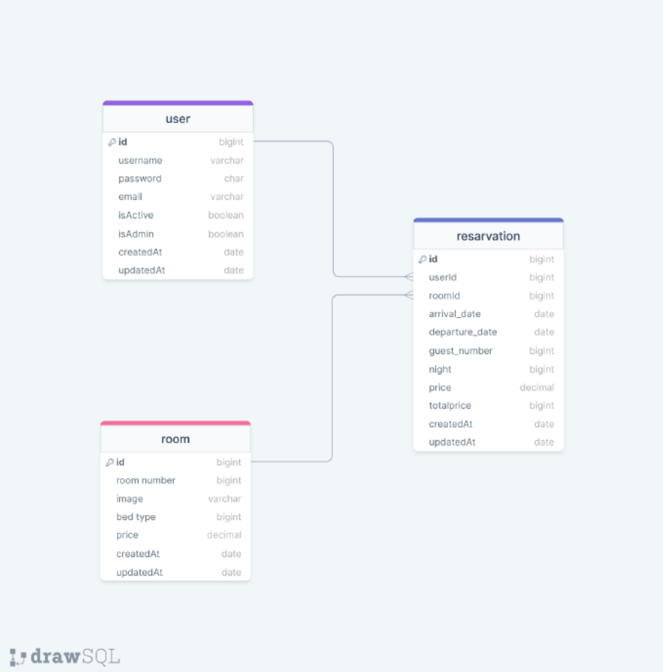
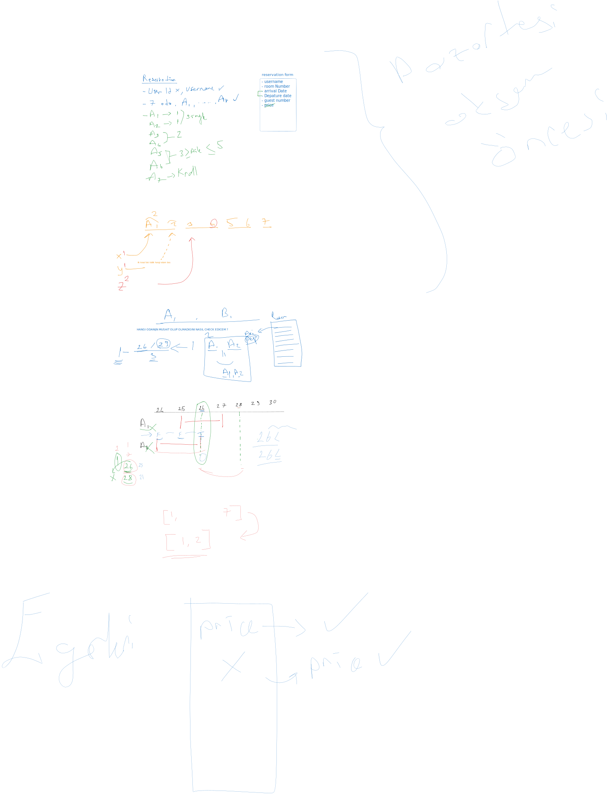

# Hotel-Api

### ERD:



### Folder/File Structure:

```
    .env
    .gitignore
    index.js
    package.json
    readme.md
    logs/
    src/
        configs/
            dbConnection.js
        controllers/
            auth.js
            room.js
            token.js
            reservation.js
            user.js
        helpers/
            passwordEncrypt.js
            sync.js
        middlewares/
            authentication.js
            errorHandler.js
            queryHandler.js
            logger.js
            permissions.js
        models/
            room.js
            token.js
            reservation.js
            user.js
        routes/
            auth.js
            document.js
            index.js
            room.js
            token.js
            reservation.js
            user.js
```


